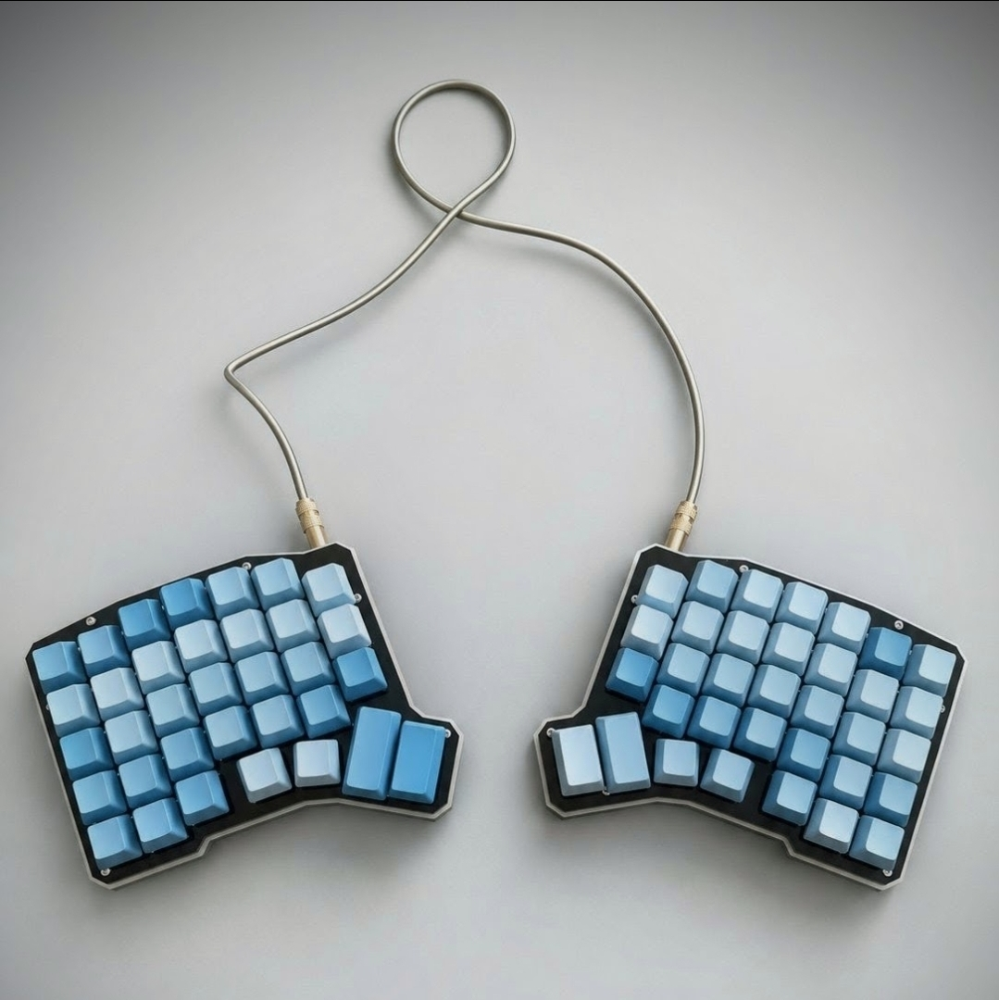
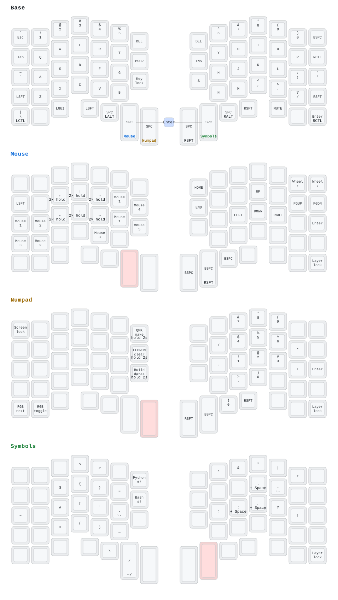

# Paulo Medeiros's Yushakobo Ergo68 keymap

My [QMK](https://docs.qmk.fm/) keymap for the
[Yushakobo Ergo68](https://shop.yushakobo.jp/products/ergo68), maintained in
External Userspace.

<p align="center">
  
</p>



## Host keyboard layout

Designed for [EurKEY](https://eurkey.steffen.bruentjen.eu/): it preserves the
US layout for programming symbols and provides European letters through AltGr,
without making common punctuation keys dead keys.

Plain US supports the ASCII letters and symbols but lacks EurKEY's AltGr
behavior. Other host layouts require reviewing printable keycodes and
`SEND_STRING` macros.

## Features

Some behavior is largely portable between QMK keymaps, while another part depends,
naturally, on this layout, the split hardware, or the Ergo68's RGB matrix.

### Mostly portable behavior

- **Mouse acceleration:** Holding a mouse direction after a double tap within
  100 ms uses maximum pointer acceleration.
- **Punctuation macros:** The custom punctuation keys append Space when held
  for 150 ms. The custom slash and minus keys select `/` versus `~/`, and `-`
  versus ` -`, by tap or hold.
- **Bracket pairs:** Typing `{}`, `[]`, or `()` within 300 ms moves the cursor
  between the pair. An intervening keypress cancels the behavior.
- **Auto Shift toggle:** Holding the left thumb Shift alone for one second on
  Base toggles Auto Shift when released; another keyboard keypress cancels the
  toggle.
- **Key Lock:** Locks the next basic key until that key or Key Lock is pressed
  again.
- **Layer Lock:** The far-right thumb key on Mouse, Numpad, and Symbols locks
  the active layer until that key is pressed again.
- **Screen Lock:** Sends `Control+Command+Q` on macOS and `Super+L` on Windows.
  On Linux it sends GNOME's `Super+L`, followed by KDE's `Control+Alt+L`; other
  or customized desktops may require remapping one of those shortcuts. QMK
  host-OS detection is best-effort; an uncertain result uses `Super+L`.

### Ergo68 keymap integration

- **Modified Space:** The thumb Space keys are dual-role. Tapping one while
  Shift or Alt is held sends Backspace instead.
- **Enter combo:** The Mouse and Symbols thumb keys form Enter. This combo works
  only on Base, must be tapped within its 30 ms chord window, and is disabled
  while Shift or Alt is held.
- **Caps Word:** Both Shifts activate Caps Word.
- **Mode indicators:** Active typing modes are shown in magenta: the left thumb
  Shift while Auto Shift is enabled, all Shift keys during Caps Word, and the
  Key Lock key while it is waiting for or holding a key. The Layer Lock key is
  also magenta while its layer is locked. The left thumb Shift turns yellow
  when releasing it will toggle Auto Shift.
- **Unassigned keys:** On each layer, LEDs under unassigned keys are turned off.
  Transparent keys, which inherit their action from a lower layer, remain
  illuminated.
- **System actions:** System keys require a two-second hold. Make types and
  submits the QMK compile command, Shift+Make does the same for flash,
  Ctrl+Shift+Make enters the bootloader, EEPROM Clear erases persisted QMK
  settings and restarts the keyboard, and Build Dates types both halves'
  compilation timestamps. While a system key is arming, the other LEDs turn
  off and the Numpad indicator blinks red; after confirmation, it turns yellow
  briefly before the action runs.

> **Caution:** Make and Shift+Make type a command followed by Enter. Use them
> only while a trusted terminal is focused.

## Firmware downloads

Download `yushakobo_ergo68_paulovcmedeiros.hex` from the
[latest firmware release](https://github.com/paulovcmedeiros/qmk_userspace/releases/tag/latest)
and follow QMK's [flashing guide](https://docs.qmk.fm/newbs_flashing).

The `latest` release contains a successful build from `main`, without hardware
validation. Flash the same file to each half separately.

## Build and flash

After completing the [development setup](DEVELOPMENT.md#development-setup),
build or build-and-flash with:

```sh
qmk compile -kb yushakobo/ergo68 -km paulovcmedeiros
qmk flash -kb yushakobo/ergo68 -km paulovcmedeiros
```

Shift+Make first looks for
`$(qmk userspace-path)/yushakobo_ergo68_paulovcmedeiros.hex`; if it is absent, it
falls back to the build-and-flash command above.

## Live keymap preview

[watch-ergo68-keymap.py](watch-ergo68-keymap.py) monitors the keymap source and
diagram configuration, regenerates the SVG, and refreshes it in a browser:

```sh
./watch-ergo68-keymap.py
```

Although configured for this Ergo68 keymap, its QMK-to-keymap-drawer pipeline
can be adapted to other QMK keymaps. See the
[development guide](DEVELOPMENT.md#live-keymap-preview) for dependencies,
options, and editing instructions.

## Customizing the keymap

Edit `keymap.c`, then compile and flash. VIA/Remap live remapping is disabled.

See [DEVELOPMENT.md](DEVELOPMENT.md) for the complete development setup.
